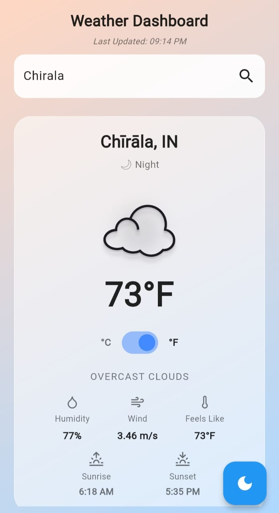
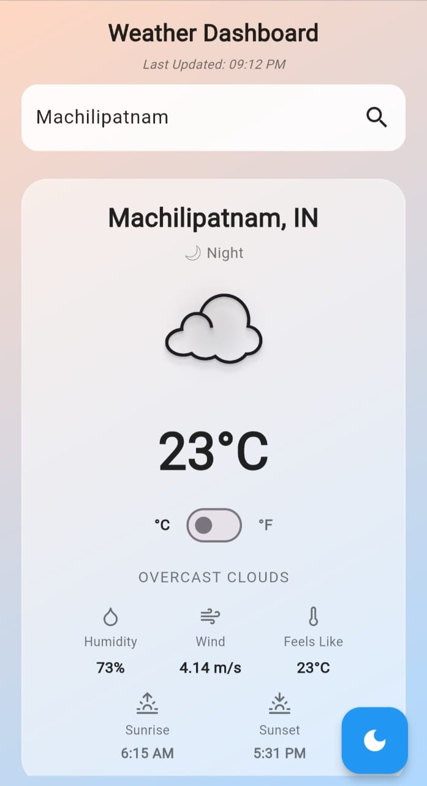
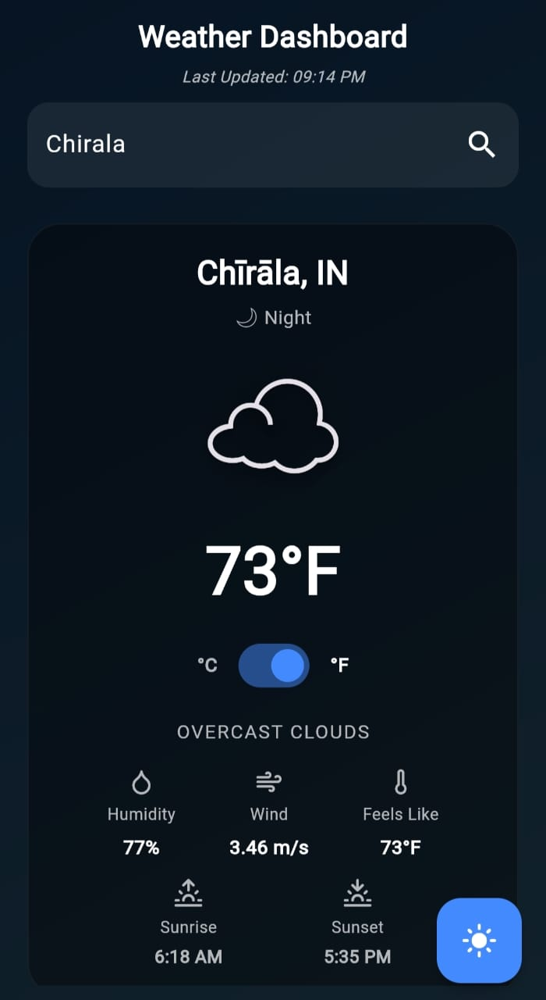

🌤️ Weather Dashboard

A sleek, responsive Flutter Web weather app with real-time data, hourly updates, and a 5-day forecast — all with smooth animations and light/dark mode.

🔗 Live Demo:

https://kvsschinmaye.github.io/weather_dashboard/

✨ Features:

 Search any city
 
 Light / Dark mode
 
 °C / °F toggle
 
 Hourly forecast
 
 5-Day forecast
 
 Animated weather icons
 
 Mobile-friendly UI

## 📸 Screenshots

### ☀️ Light Mode  

  
  
  

---

### 🌙 Dark Mode  

  
  

🛠️ Tech

Flutter Web

OpenWeather API

GitHub Pages

GitHub Actions

📦 Installation & Running Locally

git clone https://github.com/kvsschinmaye/weather_dashboard.git

cd weather_dashboard

flutter pub get

flutter run -d chrome

🚀 Build for Web

flutter build web --release

📜 License

MIT License.

👨‍💻 Author

K V Sai Sri Chinmaye

https://github.com/kvsschinmaye
